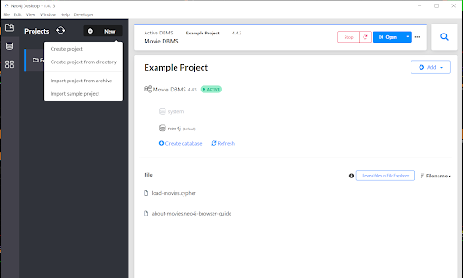
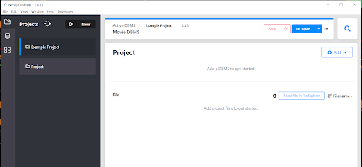
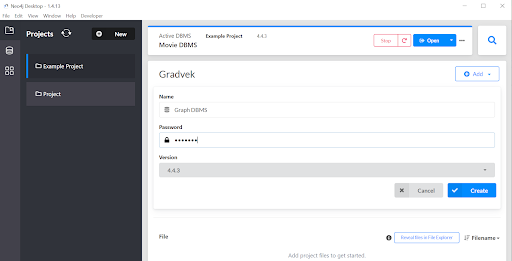
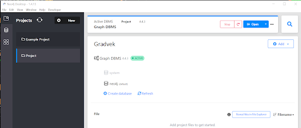
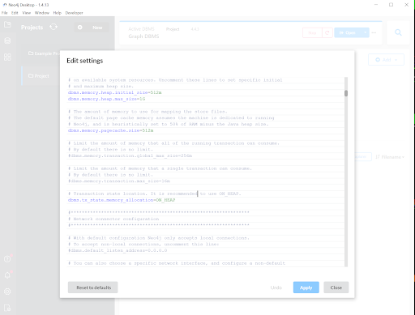
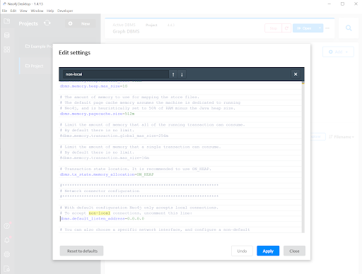
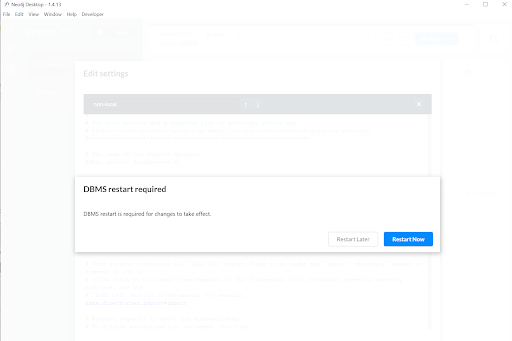
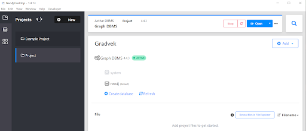

# gradvek

GRaph of ADVerse Event Knowledge

## System installation

### Developer installation manual

As in many complex software systems, gradvek requires installation of other software components that the software is built on. Below are all the steps to  install all the required dependencies.

The gradvek application can be run on a server that has both bash and the Docker Engine installed. One such option in the cloud is a container-optimized Compute Engine VM on the Google Cloud Platform.

First, copy the demo/docker-compose.yml file to the server, and then run the demo/install.sh script on the server. This can be done with the following commands (for example, via SSH):

curl {path to master}/demo/docker-compose.yml > docker-compose.yml
curl -s {path to master}/demo/install.sh | bash

where {path to master} is https://raw.githubusercontent.com/capstone-SEMIS/gradvek/master for this project.

Then, as long as port 80 of the server is available on the Internet, you can navigate to the URL of the server to access the application.
  Note that this instance is intended as a demo controlled by the dev team, not as a production instance controlled by the customer.  The demo server is accessible at http://34.134.56.173 on the web.

### Neo4J Desktop installation
We use Neo4j as the graph database of choice to store OpenTarget data. 

Go to https://neo4j.com/download/
Download the executable file
On the next screen, the Neo4j Desktop Activation Key is presented. Store that key.
Double click to install the executable and go through all the installation steps
On start-up of the program, it will prompt to enter the Software key, which is the Neo4j Desktop Activation Key in Step 3
When Neo4j Desktop launches, a screen like this will appear with the default example Movie database

1. Click on **New** button and select **Create** project

2. Next screen shows Project

3. Change Project to Gradvek

4. Click on Add button and select Local DBMS

5. Set password to **gradvek** and click on **Create** button

6. Hover over Graph DBMS and click on Start

7. Neo4j database finishes starting up.

8. Hover over Graph DBMS and click on the three dots and select Settings

9. Search for “non-local” line and uncomment it

10. Uncommented and click on **Apply** button

11. Click on **Restart Now** button 

12. The database should be in Active status after the restarts.

### Docker Installation
Docker is an open platform developing, shipping, and running applications. Go to https://docs.docker.com/get-docker/ and selected the version of Docker that is appropriate for your operating system. Download and follow the installation instructions.

### Node & NPM installation
Node.js is designed to build scalable network applications as an asynchronous event-driven 
JavaScript runtime. Npm is two things. The first thing is that it’s an online repository for publishing open-source Node.js projects. Secondly, It’s a command-line utility for interacting with the online repository that aids in package installation, dependency management, and version management. 

Please note installing node

1) Go to https://nodejs.org/en/download/
2) Select the version of node.js that is appropriate for the operating system of the computer that node.js will be installed
3) Once the installer is done downloading, launch it.
4) The installer will ask if you want to run the software - click Run.
5) You will be greeted with the Node.js Setup Wizard - click Next.
6) On the next screen, review the license agreement. Click Next to agree to the terms of the software.
7) Finally, click the Install button to run the installer. When it completes, click Finish.
Installation Verification:
    1) One the terminal or command line, type: node -v to check the version of node.js .
    2) Type npm -v to check the version of npm installed is correct.
